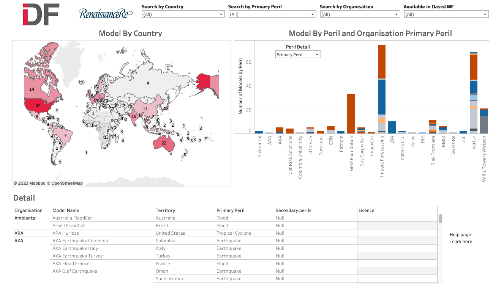

CatRiskTools
=================

Welcome to the help page and documentation of the `CatRiskTools risk model catalogue <https://public.tableau.com/app/profile/insdevforum/viz/CatRiskTools/CatRiskTools>`_.

CatRiskTools is a public good resource to help people find out where catastrophe risk models are available in the World - and locations which are not well served by models. 

The catalogue can be searched by country, by peril (hazard), and by model provider.
Searches can be carried out using the drop down boxes, by clicking on the map, or by clicking on the bar charts.

Models matching the search are shown at the bottom of the screen. Click on a model record to see more technical details and contact information to access the model.

CatRiskTools was developed by the `Insurance Development Forum (IDF) Risk Modelling Steering Group (RMSG) <https://www.insdevforum.org/working-groups/rmsg/>`_ and is maintained by IDF RMSG and RenaissanceRe.

What does CatRiskTools contain?
---------------------------------

CatRiskTools provides listings of models developed for a particular country and peril/hazard, which are available to run 'off-the shelf'. It includes models available under open licence and commercially licenced models.

Using CatRiskTools you can quickly understand:

* How many models exist for a country and peril/hazard
* Where there are gaps in model coverage globally
* Who provides which models and how to access the model 

For each model in CatRiskTools, you can also find technical information including: 

* Primary and secondary perils included
* The model licence and how it is available
* Whether or not the model is available on the Oasis Loss Modelling Framework
* Year of release and latest update
* Whether or not the model has a financial module for modelling insurance policies / contract terms

Risk profiles and global risk analysis platforms
-------------------------------------------------

CatRiskTools does not include risk analysis platforms which enable risk analysis do not provide an off-the-shelf model to use, or risk profiles, which present the results and interpretation of risk analyses. This section provides some for key sources of risk profiles and platforms.

** *Global risk analysis platforms* **

The platforms listed below provide the functionality to analyse risk, in free and open-source environments. This resource will be update with more detail over time.

.. list-table:: Global Risk Platforms
   :widths: 25 25 25
   :header-rows: 1

   * - Platform
     - URL
     - Description
   * - OpenQuake (GEM Foundation)
     - `platform.openquake.org <https://platform.openquake.org/>`_
     - The OpenQuake Platform, by the GEM Foundation is a web-based platform offers an interactive environment in which users can access, manipulate, share and add data, and explore models and tools for integrated assessment of earthquake risk.
   * - RiskScape (NIWA and GNS Science)
     - `riskscape.org.nz <https://riskscape.org.nz/>`_
     - RiskScape is an open-source spatial data processing application used for **multi-hazard risk analysis**. RiskScape is highly customisable, letting modellers tailor the risk analysis to suit the problem domain and input data being modelled.
   * - CAPRA
     - `ecapra.org <https://ecapra.org/>`_
     - The CAPRA (Probabilistic Risk Assessment) Platform is an initiative that aims to strengthen the institutional capacity for assessing, understanding and communicating disaster risk, with the ultimate goal of integrating disaster risk information into development policies and programs. Under the CAPRA platform, government, institutions, private companies and other agencies address specific development challenges and meet disaster risk information needs through specialized software applications, extensive documentation, consultancy and advisory services, hands-on practical training and other complementary services.
   * - InaSAFE
     - `inasafe.org <http://inasafe.org/>`_
     - InaSAFE is free software that produces realistic natural hazard **impact scenarios** for better planning, preparedness and response activities. It provides a simple but rigorous way to combine data from scientists, local governments and communities to provide insights into the likely impacts of future disaster events.
   * - RASOR
     - `www.rasor-project.eu <http://www.rasor-project.eu/>`_
     - The Rapid Analysis and Spatialisation Of Risk (RASOR) project will develop a platform to perform multi-hazard risk analysis to support the full cycle of disaster management, including targeted support to critical infrastructure monitoring and climate change impact assessment.
   * - Oasis Loss Modelling Framework
     - `oasislmf.org <https://oasislmf.org/>`_
     - The Oasis Loss Modelling Framework provides an open source platform for developing, deploying and executing catastrophe models. It uses a full simulation engine and makes no restrictions on the modelling approach. Models are packaged in a standard format and the components can be from any source, such as model vendors, academic and research groups.

 
** *Risk profiles* **

Risk profiles which provide the results of risk assessments. They can be used to understand the distribution and drivers of risk in many countries. Frequently, risk profiles are conducted at national scale, with regional and/or global data and assumptions. While they provide a reasonable estimate, they are frequently not intended for detailed design of infrastructure or adaptation strategies. It is important to understand the methods, date of analysis and level of analysis before use. This resource will be update with more detail over time.

.. list-table:: Risk profiles
   :widths: 15 15 15
   :header-rows: 1

   * - Source
     - URL
     - Description
   * - World Bank Riskviewer 
     - `riskviewer.worldbank.org/ <https://riskviewer.worldbank.org/>`_
     - Interactive viewer containing World Bank multi-hazard risk profiles. Enables comparison of multiple risk profiles for the Latin America Caribbean region, expanding to other regions.
   * - GFDRR Country risk profiles
     - `gfdrr.org/en/disaster-risk-country-profiles <https://www.gfdrr.org/en/disaster-risk-country-profiles>`_
     - Risk profiles produced by GFDRR (PDF). Includes multi-hazard profiles for Sub-Saharan Africa, Europe and Central Asia, Latina America and the Caribbean, and South Asia.
   * - UNDRR country risk profiles for Africa
     - `riskprofilesundrr.org/riskprofiles/ <http://riskprofilesundrr.org/riskprofiles/>`_
     - Multi-hazard risk profiles produced by UNDRR for 16 African countries (PDF). as part of the EU-ACP Programme “Building Disaster Resilience to Natural Hazards in Sub-Saharan African Regions, Countries and Communities".
   * - GEM Foundation country risk profiles
     - `globalquakemodel.org/country-risk-profiles <https://www.globalquakemodel.org/country-risk-profiles>`_
     - Earthquake risk profiles generated from the GEM global mosaic of earthquake models (PDF).

   

   
